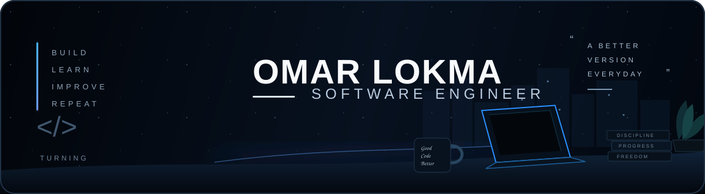

<div align="center">



<br/>

# 👋 Hi, I'm Omar Lokma

### Software Engineer

<br/>

<a href="https://github.com/Omarlokma">
  
</a>
<a href="https://github.com/Omarlokma">
  
</a>
<a href="mailto:lokmax2@gmail.com">
  
</a>

</div>

<br/>

---

## ⚡ About Me

I'm a **Frontend Developer** and Computer Science student passionate about building clean, responsive, and maintainable web applications.

I enjoy turning ideas into polished interfaces while focusing on **component architecture, API integration, responsive design, and user experience**.

```text
Frontend Development
        │
        ├── React.js
        ├── JavaScript / TypeScript
        ├── Responsive UI
        └── REST API Integration
        │
        ▼
Full-Stack Development
        │
        ├── Node.js
        ├── Express
        ├── Docker
        └── AWS
```

### Currently
- ⚛️ Building applications with **React & TypeScript**
- 🔌 Working with **REST APIs and backend integration**
- 🐳 Learning **Docker & deployment**
- ☁️ Exploring **AWS & Cloud fundamentals**
- 🧠 Improving my **System Design & Software Architecture**
- 🤝 Enjoying collaborative software development

---

## 🛠️ Tech Arsenal

### Frontend

<p>

</p>

### Backend & Programming

<p>

</p>

### Tools & Cloud

<p>

</p>

---

## 📊 GitHub Analytics

<div align="center">


</div>

<br/>

<div align="center">


</div>

---

## 🐍 Contribution Activity

<div align="center">


</div>

---


<table>
<tr>
<td width="50%">

### 🎬 Movie App

A responsive movie application focused on clean UI, reusable components and API integration.

**Stack**

`React` `JavaScript` `REST API`

</td>

<td width="50%">

### ✅ To-Do App

A simple and responsive task management application built with a focus on usability and clean frontend structure.

**Stack**

`React` `JavaScript` `CSS`

</td>
</tr>

<tr>
<td width="50%">

### 🎓 GPA Calculator

A practical web application for calculating GPA with a simple and responsive interface.

**Stack**

`HTML` `CSS` `JavaScript`

</td>

<td width="50%">

### 💻 More Projects

I'm continuously building and experimenting with new projects while expanding my skills across frontend, backend and cloud technologies.

**Explore**

<a href="https://github.com/Omarlokma?tab=repositories">
View all repositories →
</a>

</td>
</tr>
</table>

---

## 🧠 Currently Learning

<div align="center">

```text
React & TypeScript
        ↓
Node.js & Express
        ↓
REST APIs & Backend Integration
        ↓
Docker & Deployment
        ↓
AWS Cloud
        ↓
System Design
```

</div>

---

## 🎯 Engineering Focus

| Area | Focus |
|---|---|
| 🎨 Frontend | React, TypeScript, Responsive UI |
| 🧩 Architecture | Components, Clean Code, Design Patterns |
| 🔌 Integration | REST APIs, Backend Integration |
| ☁️ Cloud | AWS Fundamentals |
| 🐳 DevOps | Docker & Deployment |
| 🧠 Computer Science | OOP, DSA, System Design |

---

## 📫 Let's Connect

<div align="center">

<a href="https://github.com/Omarlokma">

</a>

<a href="https://www.linkedin.com/in/omar-lokma">

</a>

<a href="mailto:lokmax2@gmail.com">

</a>

</div>

<br/>

<div align="center">


<br/><br/>

### Building thoughtful interfaces, one component at a time. 🚀

</div>
